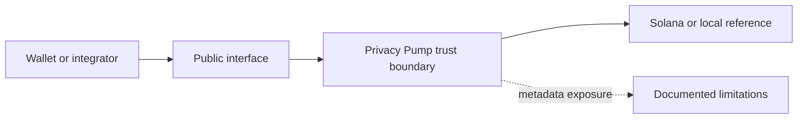

# privacy-pump-security

> **Maturity:** Public security documentation  
> **Supported network:** All documented environments  
> **Audit status:** Publication is not an audit. No external audit is claimed.

Security policies, public threat models, audit status, supported versions, and coordinated disclosure guidance for Privacy Pump.

## Purpose

Provides the public security posture, trust assumptions, upgradeability disclosures, limitations, and coordinated disclosure process.

## Scope

- Threat-model index
- Audit-status matrix
- Relayer, Arcium, ZK, browser, RPC, Waku, and metadata assumptions

## Architecture



See [ARCHITECTURE.md](ARCHITECTURE.md) for component boundaries and assumptions.

## Current security status

- Experimental or reference material; not mainnet-ready.
- The inspected devnet programs are upgradeable and shared one upgrade authority at the publication audit date.
- Factory and relayer are distinct protocol roles, but a deployment may configure one signer for both.
- Production signer topology is intentionally not published.
- The ZK Pool vault-creation fee receipt does not independently bind its signer named `factory` to the Private Vault config factory; that boundary is under review.
- The ZK verifier path is fail-closed by default and is not a complete production privacy system.
- Browser, RPC, relayer, database, Waku/Logos, and Arcium metadata each have separate privacy limitations.
- Custom cryptographic glue is not described as audited.

Read [SECURITY.md](SECURITY.md) before using any material.

## Dependencies

- privacy-pump-protocol-specs

## Local setup

Use deterministic fixtures and ephemeral local keys only. No production credentials, cloud accounts, private RPC endpoints, or real wallet relationships are required.

```text
node scripts/policy-scan.mjs

```

Repository-specific build and test commands are documented when executable source is present. Placeholder repositories run documentation and policy checks only.

## Roadmap

- [ ] Publish supported-version matrix
- [ ] Link future independent audits
- [ ] Maintain public advisories

## Related Privacy Pump repositories

- `privacy-pump-protocol-specs`

## Known limitations

- Public content omits production relayer, access-control, KMS, Supabase service-role, keeper-signing, monitoring, and deployment implementations.
- Privacy depends on more than user-interface masking; metadata visible to wallets, RPCs, relayers, transports, and infrastructure remains relevant.
- Interfaces may change while the devnet architecture is stabilized.

## Contributing

See [CONTRIBUTING.md](CONTRIBUTING.md). Licensing is under review; see [LICENSE_STATUS.md](LICENSE_STATUS.md).

```

```
